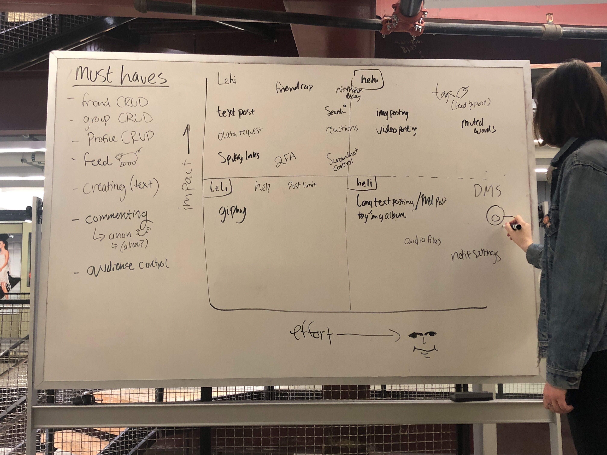
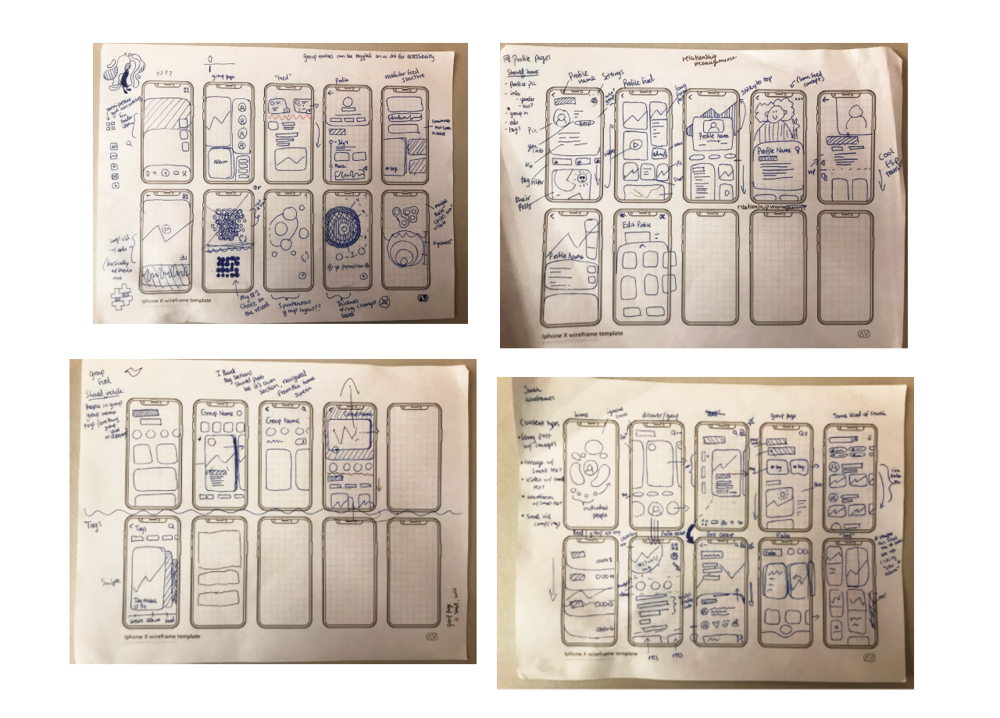
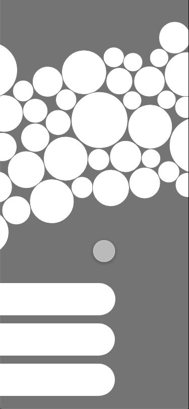
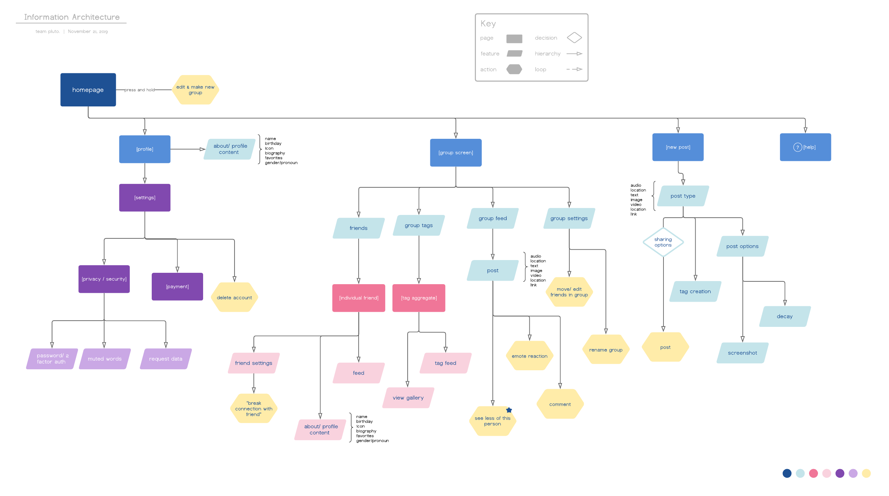
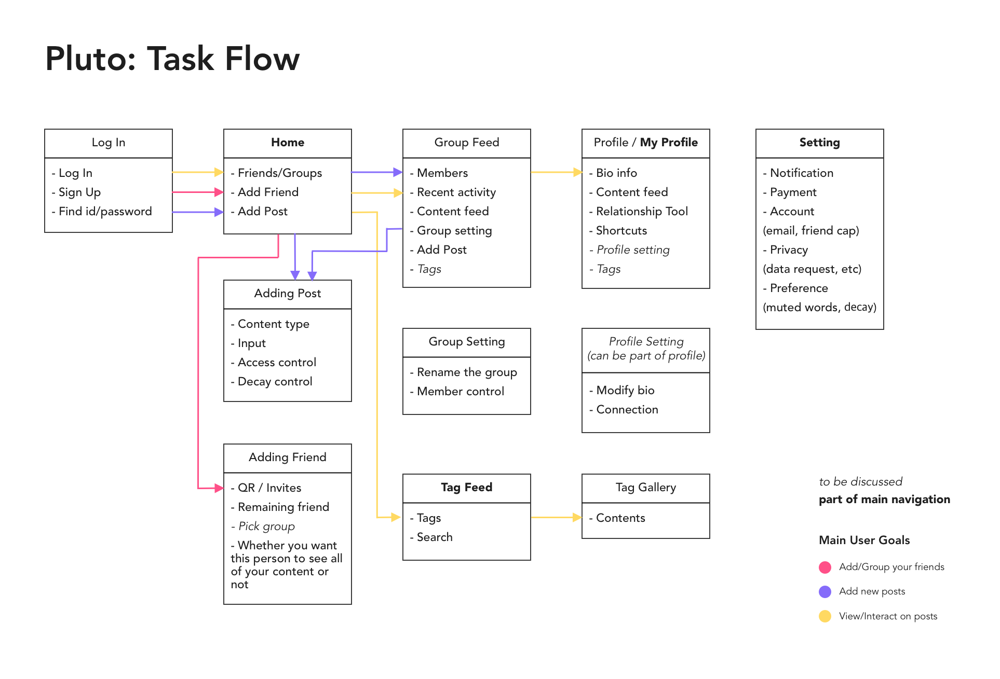

# Features
After conducting our research, we accumulated a list of what we determined to be the most important features to foster meaningful connections. To reiterate, our major findings are:
- **Repeated engagement** is key for forming meaningful connections
- Best Engagement is anything that most closely resembles **one-on-one interaction**
- Controlling who can see what equates to **privacy** and fosters sharing

## Prioritization Grid
The list of the most important, core features were then organized into a *prioritization grid*, allowing us to determine the priority of feature development. In short, a prioritization grid puts EFFORT on the X-axis and IMPACT on the Y-axis.

*Prioritization grid of features*

From here, we can target those features that have the most impact and require the lowest effort ("LEHI" as we used as an acronym). The features on the left, the "Must Haves", were considered too essential to ignore, no matter how much effort was required. Combined, these would make up the features of our MVP, or **Minimum Viable Product**.

# Wireframes
Throughout the term, we constantly iterated on our ideas for the main features, such as grouping friends and posting options, with wireframes. The goal of wireframing was to help us brainstorm for new and fresh solutions to our unique concepts in creating the tailor-fit environment for our users to connect and share with their friends.
*Screen wireframes*
*Group interaction prototype*

# Information Architecture
This was our early approach to turn our ideas into more tangible data for the application. Information Architecture is essentially the design for informational structure. During this process, our main focus was to solidify the main features with detailed actions and data required as well as categorizing them into main sections to determine how and where data will be processed.
*Information Architecture flow-chart*

# Task flow
We focused on the three main user goals to help us define the screens that will be needed to facilitate the user experience we designed: add/group friends, add new post, and view/interact your friend’s posts. Each box represents the screen as well as the tasks that can be done on the screen. The arrows in different colors show the possible user journey to accomplish the three defined goals.
*User Task Flow*
