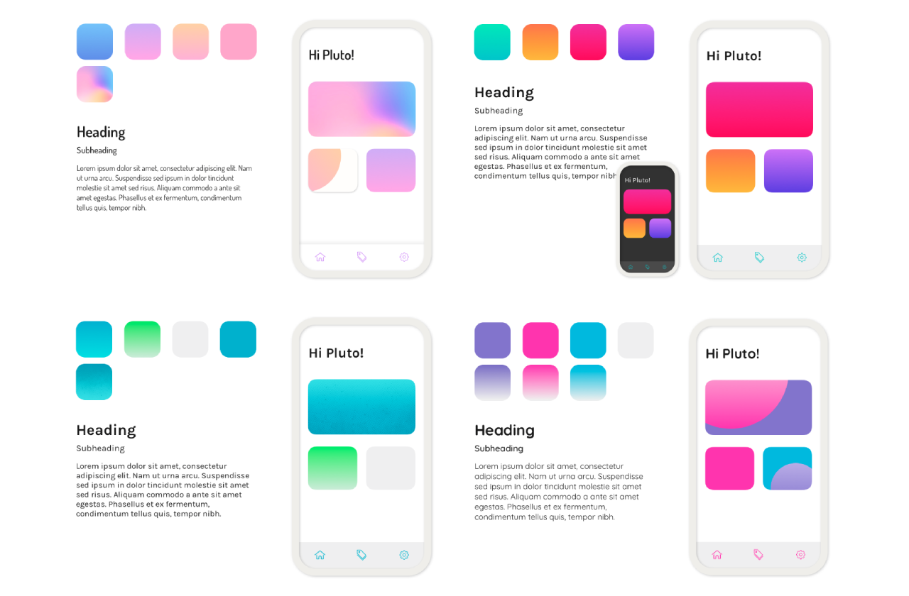

# Color Scheme & Typography
## Color Research
According to color psychology, colors are often associated with emotions. These emotional associations may influence our mental or physical states. Since the essential idea of our mission statement is to provide our users with a private and secure platform where they can freely share and connect, we focused on the colors blue and purple. These colors convey emotions such as loyalty and trustworthiness. 
*Credit to UserTesting.com*

## Typography Research
Additionally, we explored other colors, such as pink and yellow, that convey the positivity and warmth, contributing to an enjoyable and comfortable environment for our users to easily open and connect.
Typography also has its own psychology. According to the study on the typography that is used in Netflix’s titles, serif fonts are traditional and respectable, sans-serif fonts are minimal and straightforward, decorative fonts are creative and fun, and modern fonts are efficient and forward-thinking.

## Iterations
Based on our preliminary research, we ran several iterations of colors and typography to be tested for desirability in the future.
*Color Iterations*