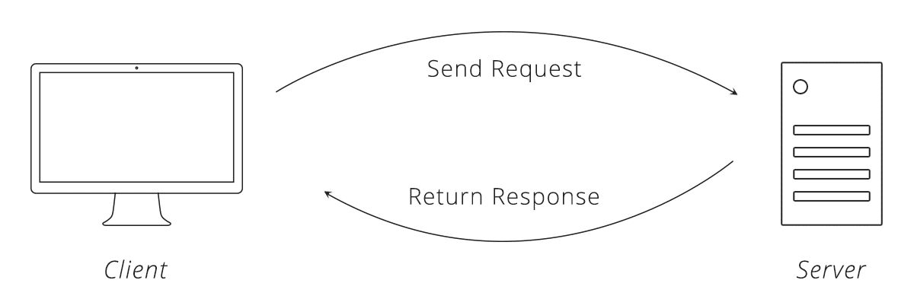
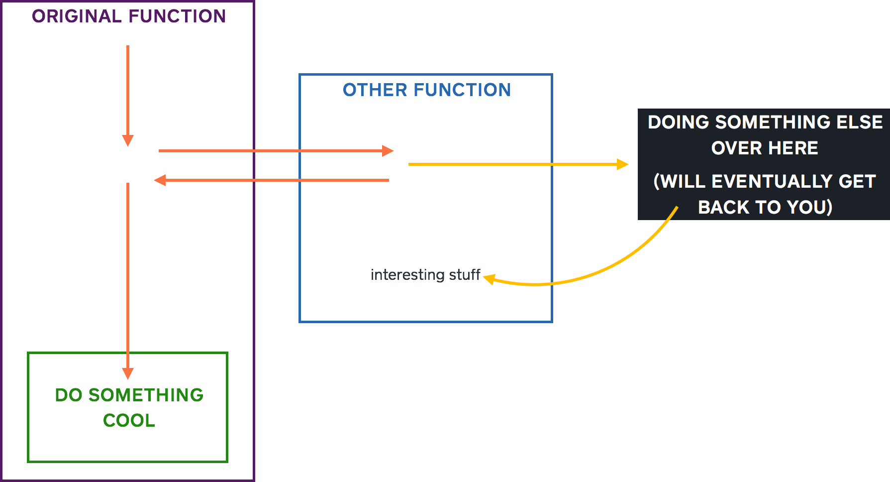

# Process

<!-- # Design -->

# Stack / Technologies


The technologies we're using to operate our server will help us serve a scalable, maintainable, flexible API. Since many of our developers only have experience writing JavaScript (JS) for front-end, we'll be using a full JS stack for front-end and back-end development.

Pluto will run on Node.JS using the Express.JS web application framework. For our database, we'll be using MongoDB and Mongoose.JS for object data modeling, which will help us maintain communicate with our database in the JS ecosystem. To maintain the integrity of our codebase, we'll be implementing Jest.JS to test our platform each time a new feature is added.

For front-end development, we'll be using React Native to develop a native mobile application. React Native will maintain our singular language ecosystem, while also enabling us to launch on iPhone and Android platforms.

# Version Control

Throughout development, we'll be using GitHub for version control. Here is a link to our GitHub organization, where our repositories lay in comfort: [https://github.com/drexel-pluto](https://github.com/drexel-pluto).

# New Code Additions

After you've written code for a new feature on your local machine, you'll want to get that work in the master branch for everyone to see and use. If you get confused and run into issues, reach out to Clay or Mike on Slack to assist you. To begin merging your code, there are a few steps:
1. Make sure your code is up to date and won't overwrite any new additions
2. Make sure your work in on a new branch titled as the feature you're working on
    - `git checkout -b Encrypts-Newly-Created-Passwords`
3. Push your code to the branch on your remote repository
    - `git add -A`
        - Make sure these are the correct files you want to add!
        - Check by running `git status`
    - `git commit -m 'Encrypts newly added passwords'`
    - `git push origin Encrypts-Newly-Created-Passwords`
5. Create a pull request to the repository, specifying that you'd like to merge your `Encrypts-Newly-Created-Passwords` branch onto the master

# Back-End Development

## Useful Links
- [Promises](https://developer.mozilla.org/en-US/docs/Web/JavaScript/Reference/Global_Objects/Promise)
- [Using Promises](https://developer.mozilla.org/en-US/docs/Web/JavaScript/Guide/Using_promises)
- [Async / Await](https://javascript.info/async-await)
- [HTTP Status Codes](https://www.restapitutorial.com/httpstatuscodes.html)
- [Request Response Cycle](https://medium.com/@jen_strong/the-request-response-cycle-of-the-web-1b7e206e9047)
- [Guidelines For Developers](https://thoughtbot.com/blog/sandi-metz-rules-for-developers)

## Repository
The back-end will be maintained in its own repository located on [our GitHub](https://github.com/drexel-pluto).

## Folder Structure
    - /Models (DB Schemas)
    - /Controllers (Route Handling)
    - /Services (Reusable functionality)
    - package.json
    - package-lock.json
    - server.js
    - env-example
    - README.md
    - .gitignore

## How this works
Welcome to backend! This is tricky stuff. Your best friend here will be your patience, because it’s a lot to learn and probably new, but we’ll get through this as a team. This process is called the [request response cycle](https://medium.com/@jen_strong/the-request-response-cycle-of-the-web-1b7e206e9047). For now, we’ll have two parts:
- THE CLIENT
    - This can be anything: a website, an app, whatever.
    - This is the thing that needs information
    - This will be asking the server for the information that it needs
    - When a “client” asks for information from a server, this is called a **REQUEST**

- THE SERVER
    - This is the thing that handles these requests and gives the client the information it needs
    - The server has an address, like https://server.com
    - Pretty much, a server is a bunch of functions that sends the information the client needs. We’ll call that info a **RESPONSE**

- REQUEST / RESPONSE CYCLE (in laymans terms)
    - Request from client comes in, hitting its address “https://server.com/api/statuses/new”
    - The server sees the request, and passes it to the router
    - Router pretty much determines what function the request should be sent to
    - The router determines what controller to send the request
    - In this case, it’ll be sent to the status controller
    - In the status controller, it will look to see what it should do, determined by the “/new”
    - If that endpoint exists, it will carry out the functions specified in the controller
    - After it’s all done, the server will send a response with the information that is needed



## Models
This is where we’ll have the Mongoose schemas for our Mongo database. Schemas are pretty much empty shells that tells our database what our object is going to look like and what to expect. Filename will be singular like `User.js` and `Status.js`.

## Controllers
When requests hit our server, we’re going to direct the requests to their appropriate controller. For example, requests asking to create a new status will be directed to the `StatusController.js`. The controller will contain the absolute MINIMUM amount of logic / code. All logic and code should be broken out into a _SERVICE_. The code in a controller should only contain the setup of a parameters object, the call to a service function that will accept the parameter object, and a response back to the requesting client.

Think of a controller as a dry cleaner: you send in a package of shirts asking them to do something, the dry cleaner does whatever it has to do to prepare your shirt, then prepares it and sends it back to you, exactly the way you asked.

## Services
This is where most logic / code will be written. Breaking code out into a service rather than writing code directly in a controller makes that code **REUSABLE**, and accessible from any controller. A service will just be a javascript file with several small functions that do very specific things. Example name would be `StatusService.js`. Functions in this file should be VERY SMALL, doing very specific things. For example, in `StatusService.js`, there might be a function just for formatting the text, then another function for removing numbers, then another function that calls both of those functions. Writing code this way makes the code **EASILY MAINTAINABLE**, easily understood, and nice to read.

## ASYNC / AWAIT
Much of our code will be written asynchronously. This means requests won't have to wait for others to finish before starting. Node.js is single-threaded, so we want to avoid _blocking_ the thread by calling heavy synchronous functions. Async functions are functions that return promises, so we’ll be able to await their return in other functions, without blocking the thread. Here's a diagram showing how async can handle multiple requests in parallel (orange lines) without waiting for the other one.



**Code example:**
```
async function getName (name) {
    if (name.length > 10) {
        return name;
    } else {
        Return Promise.reject(‘Name is too short’);
    }
}

(async () => {
    try {
        const name = await getName(‘Mike’);
        return res.status(200).send({ name });
    } catch (err) {
        return res.status(500).send({ err });
    }
})();
```
**Explanation:**
- We create an asynchronous function called checkName that accepts a name
- If the name is longer than 10 characters long, we return the name
    - Returning something is equivalent to Promise.resolve()
    - AKA, returning something will tell the await that it’s done and return that thing
-If the name is less than 10 characters, we are going to REJECT the name, which means stop everything, this will not work
    - We’ll only be rejecting if something bad or incorrect happens
- Then we get to the anonymous (no name) async function which is called automatically by wrapping it in parentheses
- Wrapping async calls in a try catch ensures that IF we reject something we are awaiting, the error will be passed to the catch
- So in our code, the program tries to getName sending in ‘Mike’, but since the name is less than 10 characters, the await is rejected
- Since the await is rejected, the message passed in the reject i.e. “Name is too short”, will be passed as a parameter to the catch, with the value “err”
- Within the catch function, we send a 500 status indicating something wrong happened, then send an object back to the request that will look like:
    - { err: Name is too short }

## Testing Endpoints
For development, we're going to use [Postman](https://www.getpostman.com/) to help us test the server's API endpoints. Since our app won't be ready and we don't want to wait, Postman will simulate talking to the server for us just like how our app will. Pretty much, Postman is a client that sends requests to a local server to make sure everything is working okay. Once the server is running locally enter the address into Postman (http://localhost:5000 [this will probably not be correct]). Specify the headers you’d like to use (will probably be Content-Type: Application/JSON). In the body, specify what you’d like to send. Send, and hopefully receive a response from the server!

NOTE: This section will be updated when we have live endpoints to use in the example.

## Up and Running
The server hasn't been initialized yet. This section will be filled in with the steps to get the repository on your local machine, and commands to run that'll get the server running locally.


