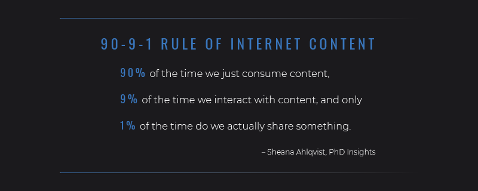

# Research

# Why we research
Every piece of research has been useful to us one way or another while creating Pluto. Various methods have helped us identify user's needs, failures in the existing marketplace, and opportunities for us to take advantage of. Research has helped us form our vision and product, as well as validate any assumptions we made at the beginning of the ideation process. Our goal is to leave no stone unturned while having a data-backed answer for each question thrown at us, and most importantly, making sure we build something people want.

# Desk Research
Desk research is exactly what it sounds like -- you sit at your desk, and read as much as you can about the field you're about to jump into. For Pluto, we made sure to take a dive into history, psychology, sociology, adn more. Here's a summary of our findings:

## History of Social Media
- Started as a participatory culture, but quickly became a culture of connectivity
- Facebook has set the norms of 'sharing'
>“The massive adoption of the Like button has turned personal data sharing by third parties into an accepted practice in the online universe; hence, the Like button epitomizes the profound modification of a social norm” (Dijck 49)

## Sociology and Philosophy of Social Media
By doing research on sociology and philosophy related to social interaction, we were able to establish some key concepts that could be beneficial in helping us define our goal. Especially since our project is experimental, it will be necessary to theorize our app’s user experience from these angles throughout the design process. The most widely used sociological theory for understanding social interaction through social media is Goffman’s Presentation of Self which equates social interaction with theatrical performance - **everyone is attempting to show the best version of themselves to the world**. This “social performance” depends on the setting, which is what we as UI/UX designers and developers have some control over.

## Bourdieu’s Social Capital
> Social Capital - an aggregation of resources that is linked to the possession of a durable network of relationships of mutual acquaintance and recognition.

- This angle of looking at social interaction shows it to be **instrumental** in nature.
- Research shows that strategy is very important when it comes to **getting the most engagement with other users on social media.**
    - Strategy concerning what to post, what to share, and whom to share with on an open platform where the message has the potential to go viral across the network.
- These strategies play a critical role in the individual’s **presentation of self.**
- **Strategic use of social media is instrumental in the pursuit of social capital**

This theory defines social interaction as **instrumental**, where individuals use others as a means to achieve **social capital**, whether they are aware of it or not. This could be related to why many individuals are finding the popular social media platforms to be “toxic”. Our mission is to create a social space that pivots from this mindset and encourages the experience of “being with others” and seeing that as the end goal rather than gaining social capital.

## Jean-Paul Sartre’s Existentialism
- **Experience** is an essential aspect of our “existential struggle”. It is our experiences that shape our identity, ideals, and worldview.
- Each human feels a need to **discover unity of their life** through these experiences.
- Most of these experiences involve social interaction and relations with others.
- Concrete relations with others are related to the way the “other” looks at “me”.
- **Social media allows people to construct coherent history of presence.**
- This can be seen as a continuation of the **memorialization of the self in media** that we’ve seen throughout history with letters, diaries, etc.

This perspective on social interaction is much less about **personal gain** than it is about the fundamental experience of **“being with others.”** It will be through this philosophical lens (or one similar to it) that we formulate the user experience of Pluto. It will emphasize **meaningful relationships over social capital.**

## A Holistic View of SNS Psychology
Social media platforms are intentionally engineered to be addicting to their users- through the core foundation of SNS/UI elements. The social concept of **“Upward social comparison”** encourages users to only post highlights of life experiences and only ever seeing other’s highlights- creating this feedback loop of inflated social expectation, which can lead to anxiety, depression, self esteem issues, etc. “Fear of Missing Out” (FOMO) is a very real effect of social media dependency. People are unsatisfied with the experience as a whole but feel as if it has been threaded into their lives in a way they can’t move beyond.
SNS extends the severity in the way in which human nature thrives in social settings. 
- Parasociality
- Pack mentality
- Heightened self evaluation

## Scholarly Article Research Takeaways
Overall, users with greater **privacy concerns** are less likely to trust social media sites with their personal information and users with higher privacy concerns are more likely to find it risky to disclose personal information to social media sites.

Having **too many Facebook ‘friends**’ and access to different social capital disrupt the sharing process due to experiences of **social surveillance and social control**.

We find that adolescents with either **too large or too small** a network have higher levels of **depressive symptoms**. Perceptions of social relationships mediate the ill effects of under-integration, but not over-integration, on depressive symptoms.

Results suggest that an **overabundance of friend connections** raises doubts about Facebook users’ popularity and desirability.

The presence of **too many followers** seems to increase the psychological distance between a user and his or her followers.

## What Makes A Luxury (Enhanced) Experience
Questions looking to answer:
- How can we elevate a free product?
- What can we do to make this worth paying for?
- Why do people pay more for something they can get cheaper?

Takeaways:
- Create a **cohesive** brand promise
- What is your message? What makes your experience different?
    - **Deliver this message through all points of contact with your brand**
        - Marketing
        - Customer Service
        - Exceptional Product

An enhanced experience needs to be conveyed at all points of interaction. A lot of it is marketing, but needs to be backed by a superior product.

## How Do People Use Social Media?
- Facebook is the most popular social media app by far, with 87% of social media app users checking it at least once per day.
- Millennials (53%) check Snapchat daily, nearly 3x more than Gen Xers (18%) and almost 8x more than baby boomers (7%).
- Over one-third of social media app users (35%) say they typically spend 10-20 minutes on a social media app after opening it.
- Nearly three-quarters of social media app users (72%) read or watch news stories on social media apps, confirming a significant shift in how news is consumed.

# Competitor Analysis
By examining competing products, we'll be able to identify missed opportunities in the marketplace. While some platforms have similar products, their message focuses on something entirely different from ours -- building meaningful connections. Noting each platforms' successes and failures will help us create a more refined final product.

## Facebook
Provides many different services such as finding a job, donating to causes, and finding a date. Huge revenue from advertising and selling pieces of their platform.
- 68% of Americans use Facebook; spending about 58 minutes per day with each individual visit lasting 10 or 12 minutes
- **Large distrust from public**

## Google+
Google+ failed for many reasons, the ultimate one most relevant to us:  
Their **asymmetric following system** where A could follow B, but B did not have to agree or follow A back did not help the community that they were trying to build

>“This unidirectional model is actually a poor choice for a close-ties network because close-ties relationships depend on frequent bidirectional communication.”

## Twitter
- A platform where you can “tweet” out a text post or image/video.
- Most activity takes place in a feed of everyone tweets where the user scrolls through and can like, retweet and comment on tweets.

Pluto is going to be the opposite of Twitter; rather than having every interaction be shown to the public, our focus is going to be small, private meaningful connections.

## Instagram
- Instagram allows you to take ordinary photos and make them look extraordinary- originating the concept of using “filters”.
- Very superficial with seemingly **high barriers for posting content**. 
- People don’t want to read long texts so they are more interested in watching **videos and pictures**.

Interestingly, most people poll with having very little privacy concerns while using Instagram as opposed to facebook.

## Tumblr
- A blogging platform where people can make their own blog as well as view a feed of blog posts from blogs they follow.
- One of Tumblrs strengths is the **tagging system** which makes it really easy and fun to view blogs that you are interested in.
- The ability to customize the appearance of your own blog gives users a **sense of individuality** and creates a space where they can truly **express themselves**.

## Snapchat
- Snapchat’s variety of **one-on-one interaction** is definitely something we want to draw from. The various visual filters and other **gamifactions** are definitely something that we will keep in mind.
- Snapchat opens directly to the camera screen, putting an emphasis on the various filters and eye candy and promoting constant and easy interaction.
- **Stories** are also a really fun way to keep up with what your friends are up to -- we might want to adopt a similar function.

Invisible incentive of automatically deleting pictures sent after opening puts engagement pressure on the users.

## YouTube
- A platform where you can make your own video channel and subscribe to others
- **Heavily based on an algorithm** that shows users what they are interested in.
- Youtube is very different from Pluto, and probably won’t have any major similarities. The UI is content-focused but in a very standard way which we want to break away from.

## TikTok
- Instagram/Vine concept of **short form video** > Music.ly > Tik Tok
- Feature rich with thousands of ways to edit and create video content, expanding so much more on the original ‘Music.ly’ format.
- **Extremely detailed security settings, fine tuning privacy and browsing limitation**

## Discord
- Intention was to create as minimal friction as possible; trying to make a seamless interface that wouldn’t remove the user from their game
- Greatest achievement was effectively **enhancing and connecting social spaces** (or hybridized third space) for the gamer
- All participants **preferred to perform tasks directly from the server screen, spending the most time interacting directly with people**
- Recently breaking into the business communication space

## Vero
- 4 different levels of sharing content. (close friend, friend, acquaintance, everyone)
- 6 different content types to post (camera, link, music, movie/tv, book, place)
- Recommendations from other people they're **connected to instead of algorithms**
- Personal library called "Collections" where you can search everything that's been shared with you
- Shopping w/o leaving feed
- Donations

At first they were going to implement a subscription model after 5 million sign ups however they still haven't because there were technical difficulties once there was a boom in registration.

Right now, Vero looks like **one of our biggest competitors**. One thing that we’ll have to think more about is our terms of service that many users were concerned about and were discouraged from signing up for Vero.

## MeWe
- Similar to other social media platforms
- Different model for monetization to subsidize for not having ads
- Feed is separated into 3 categories: contacts, groups, pages. 
- **Mixed reviews of whether or not people really trust their promise of privacy**

## Minds
-  A distributed social networking service that rewards contributors with tokens on the Ethereum blockchain.
- Focused on freedom of speech, privacy, security
- Opinion: emphasis on message of freedom of speech **distracts from functionality of the platform**
