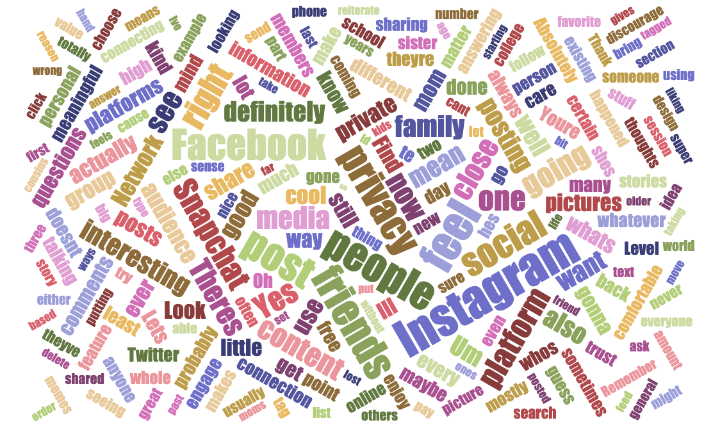

# Purpose
As we move through the development of this project, it's important to remember our mission:
> Creating a social network that prioritizes exclusively meaningful connections, giving users a platform that strengthens close relationships with an increased sense of privacy and security.

This raises a few questions for us:
- What is a meaningful connection?
- What does 'meaningful connection' mean to users?
- What does online privacy mean to users?
- What does privacy mean to users?
- What are the favorite features of existing social networks, and why?

In short, we're trying to make sure what we build directly responds to our mission of fostering meaningful connections. The team used several different methods to gather reasearch: 

# Target Audience
Our target market is for all genders 16-80, who live in English-speaking countries, and like to easily share personal content to those that are close to them. For this research, however, we’ll be targeting potential users aged 18-25 on the presumption that young users are crucial to a platform’s success.

# Screener Survey
The purpose of a screener survey is to gather study participants whom fit our target audience to perform further research on. The screener survey consisted of 15 high-level questions asking about social media usage habits. We also used this opportunity to validate early assumptions, asking high-level questions about users’ perceptions regarding privacy and their social media connections’ meaningfulness. Lasting four days, the survey garnered 250 responses with some notable results.

In short,the purpose was:
1. High-level idea validation
2. Finding target users to interview
3. Collect preliminary data

Our first screener survey, titled "Measuring User Interest in Social Media", was sent out over a peroid of five days and collected 250 responses. Here were our most significant takeaways:
- 98% use social media on their iPhone or Android phone (**mobile first!**)
- **80% use social media to connect with close friends and family, but 57% of people feel their connections on social media aren’t meaningful**
- 70% feel having a social media account makes you **‘public’**
- 65% feel current networks **don’t value their privacy**
- 20% feel they would consider **paying for social media**

# Follow-up Survey
The second survey was meant to further investigate users’ interactions with social media. With 42 responses, this survey was intended to be longer form and included many open-ended questions, hence the much smaller response rate than the screener survey.

- 88% would consider using a new social network
- 74% say they don’t want their family to see their interactions on social media
- 62% of respondents have multiple accounts on the same platform

What people enjoy the most about social media platforms:
- Staying connected
- Communicating across the globe
- Following topics they like

# Interviews
After conducting the screener survey, 16 participants fit our target demographic perfectly. They were within our age range, were happy to be interviewed further, concerned about privacy and wished they could form more meaningful connections on social media. Conducted over a span of three weeks, the four hours one-on-one interviews provided great insight into our target audience’s feelings.

**KEY TAKEAWAYS:**
- The most meaningful online connections are formed around **repeated engagement** through anything that most closely resembles **face-to-face interaction**
  - These interactions include (but not limited to) a fast response time, content that is directed at you, and response comments
- **Targeting the audience** when posting is a big factor in feeling private when posting, and would **foster more sharing**
- Users do not like thinking that their content might be shared elsewhere or may be “owned” by the company
  - Snapchats “visible screenshot” and “self-destruction” features are a perceived deterrent to this notion, leading many users to view Snapchat as the most private social media platform

# I like / I want / What if
The purpose of the IL/IW/WI survey was to have a discussion with our target demographic and gauge their feelings about current networks, determining what they like about social networks, what they wish existing social networks had, and “What if” statements to gather ideas. The discussion consisted of 10 potential users and provided key takeaways.

**Content is KING:**

Most participants’ favorite aspects of social media derives from the content they see and how they see it

**Communities Count:**

Many participants are drawn to platforms by being apart of communities

**Smart Moderation:**

Participants value free speech, but want content to be more heavily moderated

**Connections Matter:**

Participants wish many certain platforms made it easier for them to connect with others

# A/B Testing
During the interface design process, we'll use A/B testing of existing interfaces to judge the best approach to our design.

# Desirability Survey
Once our designs are ready, we'll be able to test how effective our interface is at evoking our desired emotions (meaningful, closeness, secure, etc.) through this desirability survey.